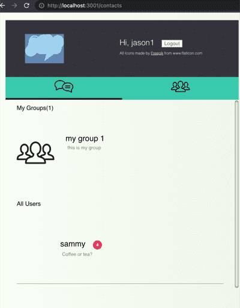
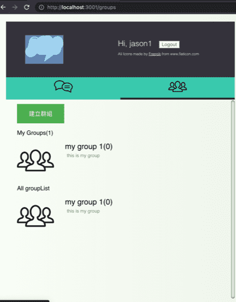
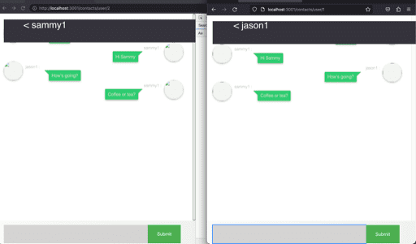
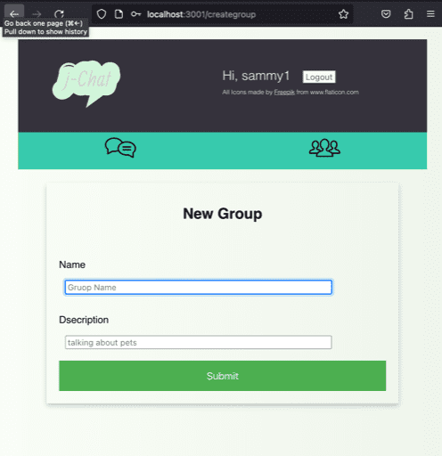

## j-chat-web

j-chat-web was my first full-stack project, created for fun using React and Node.js in February 2018 .

## Run with docker

`git clone https://github.com/JaosnHsieh/chatapi`

`git clone https://github.com/JaosnHsieh/j-chat-web`

`cd j-chat-web`

`docker-compose up`

visit `http://localhost:3001/`

## Screenshots

